# gen load balacer

外部からの通信（トラフィック）を複数のサーバーに分散するロードバランサーは、負荷分散装置とも呼ばれます。いったんサーバーへのアクセスを集約し、リソースに余裕があるサーバーを接続先として選択するといった機能により、サーバーを含むシステム全体の可用性を向上させる特長があります。

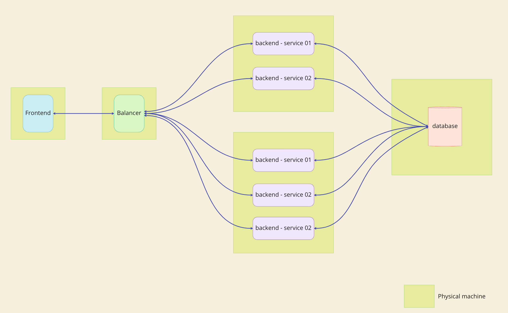


## work flow (ワークフロー)
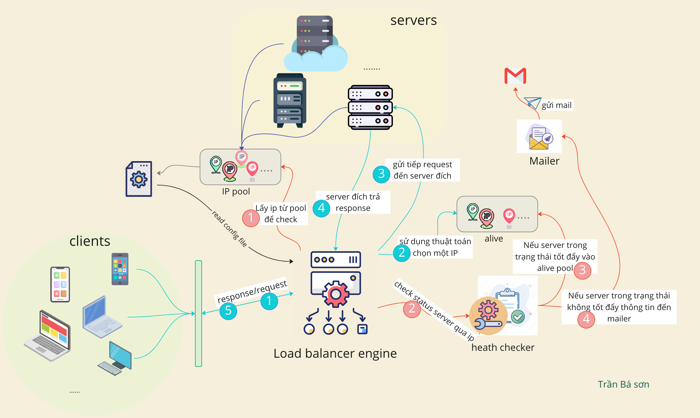

### Health check
ロードバランサーは、定期的にバックエンドサーバーにリクエストを送信してその状態を確認します。

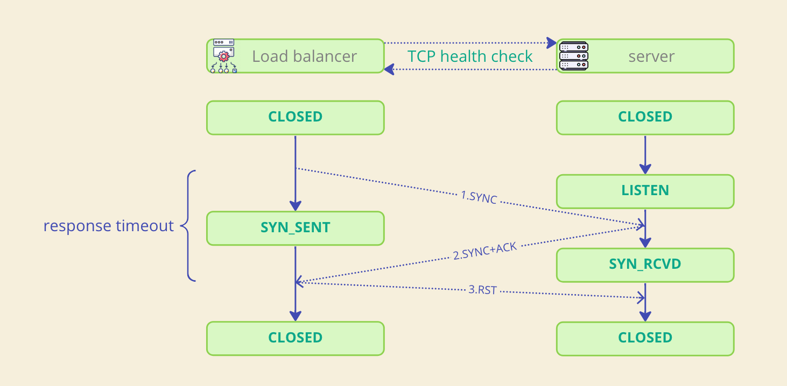
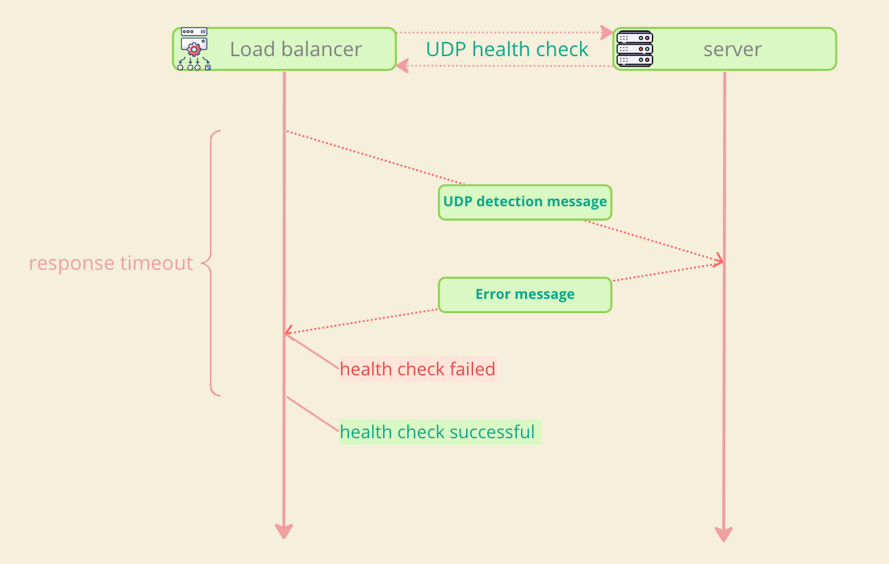

#### health check workflow
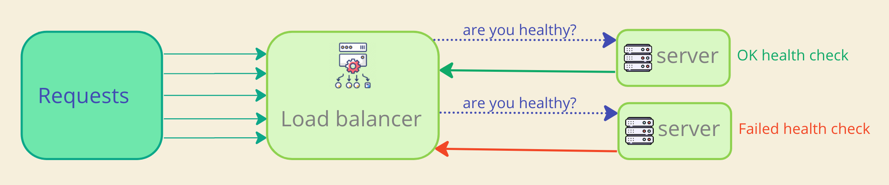
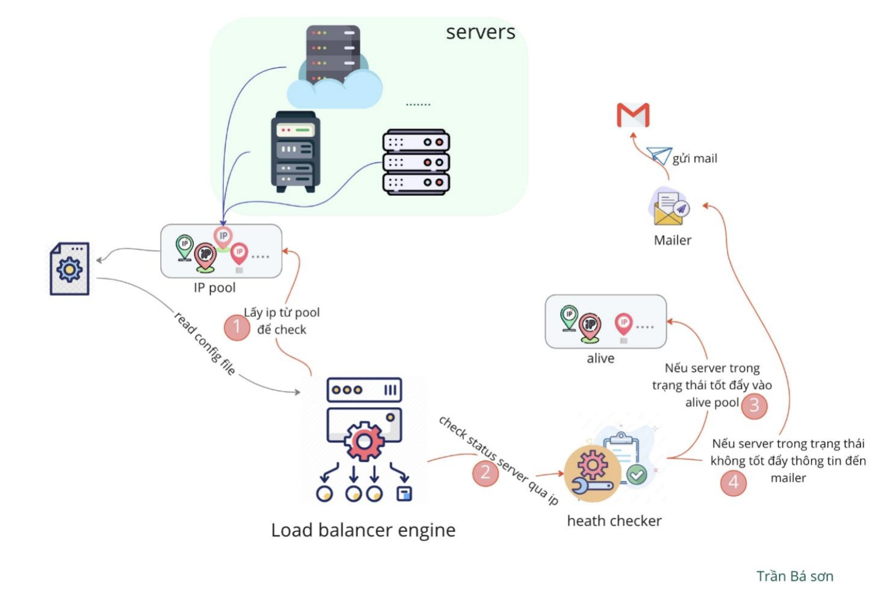

### Load Balancing algorithms

### Round robin (RR)

ラウンドロビンは、すべてのノードを1つのポイントと見なし、これらのポイントを結んで円を作成します。ラウンドロビンは、この円の上で時計回りにポイントを選択します。

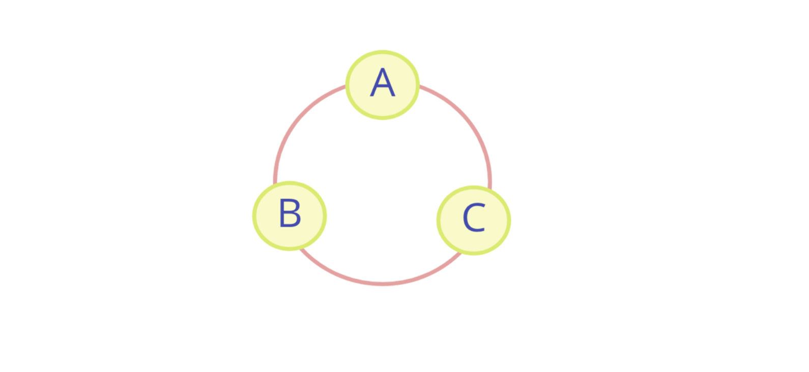

code demo
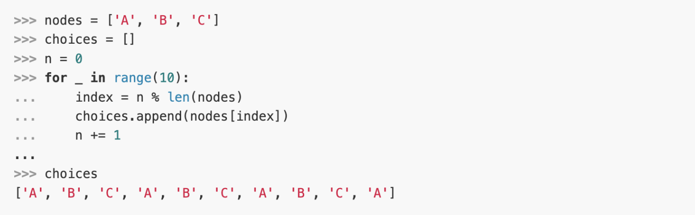

### Weighted Round Robin (WRR)
加重ラウンドロビン（Weighted Round Robin, WRR）も、静的ロードバランシングのための一般的なアルゴリズムです。WRRの原理はRRと同じですが、唯一の違いは各サーバーに重み（ウェイト）が割り当てられていることです。この重みは各サーバーの構成と要求処理能力を表しています。例えば、サーバーAの構成がサーバーBの2倍であれば、サーバーAはサーバーBの2倍の要求を処理します。

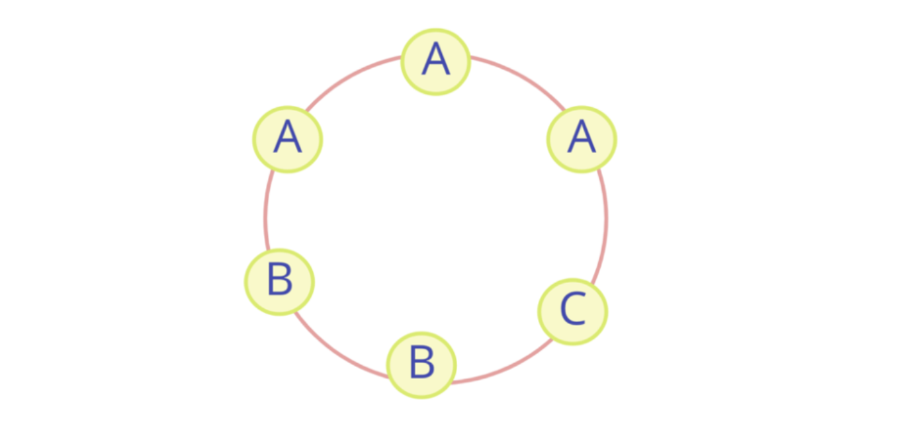

code demo
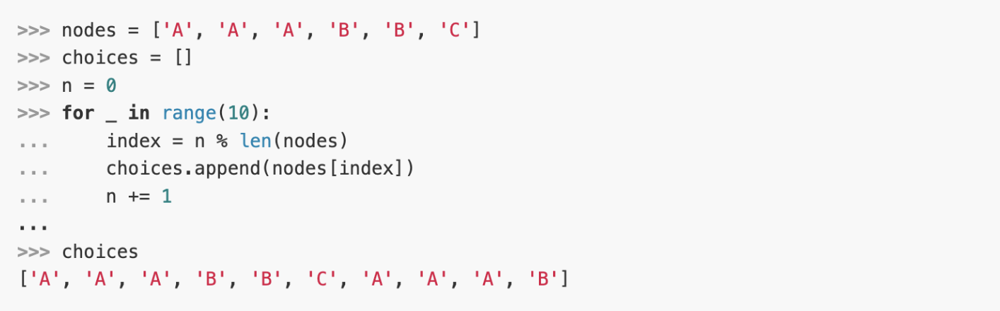

### Random selection
ランダムセレクションは、バックエンドリストからサービスを提供するノードをランダムに選ぶ方法です。この方法では、全てのノードを一つの点と見なし、それらの点を直線で結びます。ランダムセレクションは、この直線上の任意の点をランダムに選びます。


code demo
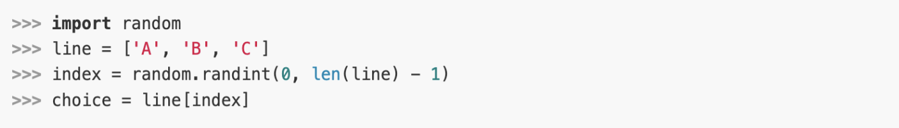

### Weighted Random selection

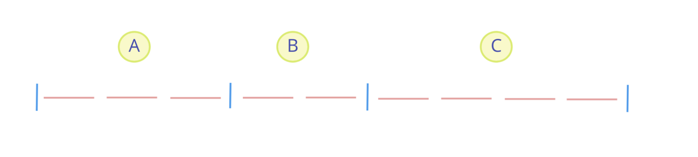

code demo
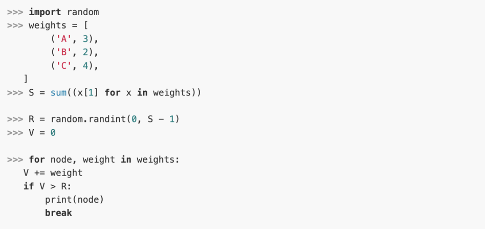

### Integrated trace and metric

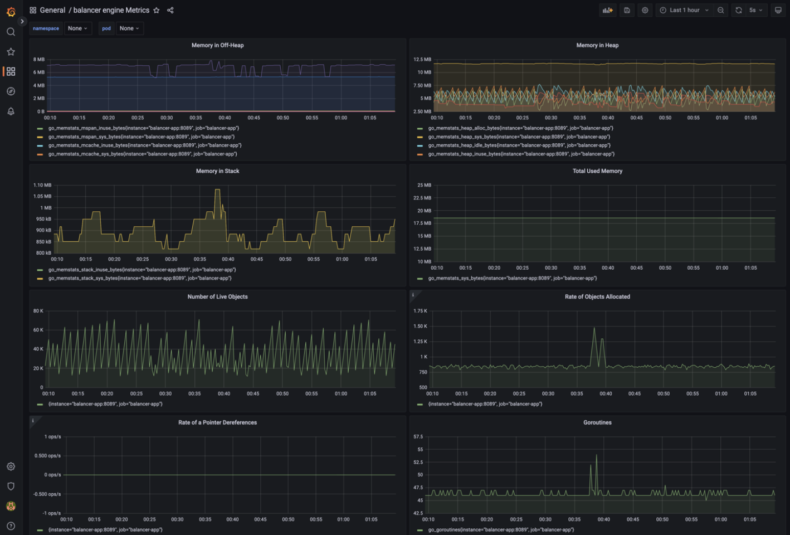
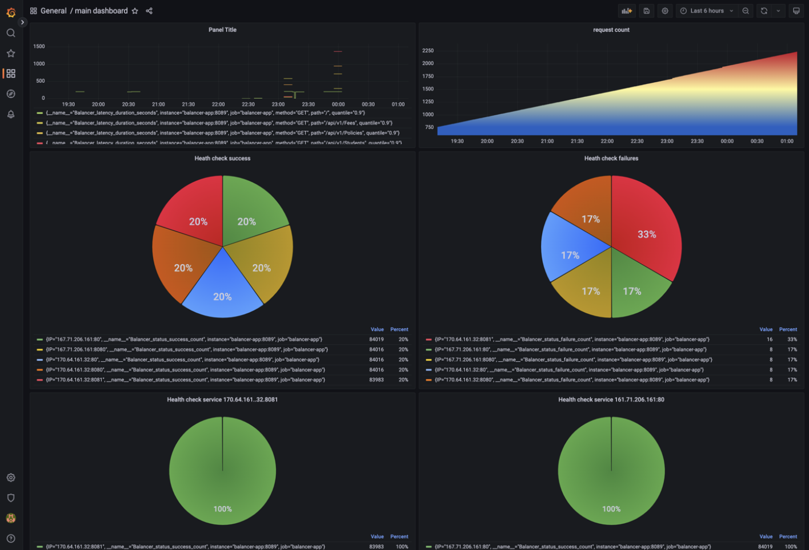

### Gudie configuration

```yaml
# The load balancing algorithms supported by the balancer are:
# `round-robin` ,`random` ,`p2c` ,`consistent-hash` ,`least-load` ,`bounded` ,`ip-hash`,
# Among these,`p2c` refers to the power of 2 random choice,
# `bounded` refers to consistent hash with bounded.

schema: http # support http and https
port: 8088 # port for balancer
ssl_certificate:
ssl_certificate_key:
tcp_health_check: true
health_check_interval: 3 # health check interval (second)
# The maximum number of requests that the balancer can handle at the same time
# 0 refers to no limit to the maximum number of requests
max_allowed: 100
location: # route matching for reverse proxy
    - pattern: /
      proxy_pass: # URL of the reverse proxy
          - "http://localhost:9001"
          - "http://localhost:9002"
          - "http://localhost:9000"
      balance_mode: round-robin # load balancing algorithm

     - pattern: /api/v1/Policies # demo policies pattern
      proxy_pass: # URL of the reverse proxy
          - "http://localhost:9000"
          - "http://localhost:9002"
      balance_mode: round-robin # load balancing algorithm

    - pattern: /api/v1/user # demo users pattern
      proxy_pass: # URL of the reverse proxy
          - "http://localhost:9000"
          - "http://localhost:9001"
      balance_mode: round-robin # load balancing algorithm


# email config
#smtp_host: smtp.mailtrap.io
#smtp_port: 2525
#username: fca5b15809ec4c
#password: 467c483b24279c
#sender: GenBalancer <no-reply@genbalancer.hau.edu.vn>

smtp_host: smtp.gmail.com
smtp_port: 587
username: username
password: password
sender: email sender
recipient: email recipient

```
